# \[AI技术分享\-1\.6\] \- LLM大模型入门

# 前言

> 2023年初chatgpt横空出世，到如今各种AI模型横空出世，出现了各种领域的Agent，程序员必备的Vibe Coding技能，全部都离不开一个最底层的架构 \-\- Transformer，它为LLM大模型奠定了架构基础，这篇文章希望用尽可能简短地篇章，让读者快速理解到Transformer的工作原理，以及背后的精髓。
> 
> 


# 前置数学基础

向量通常由一个一维数组存储，在机器学习里面通常可以用了表达一组特征集合，每个index都分别代表某个特征参数的数值，理解向量的运算对后续模型原来学习至关重要。


### 矩阵相乘

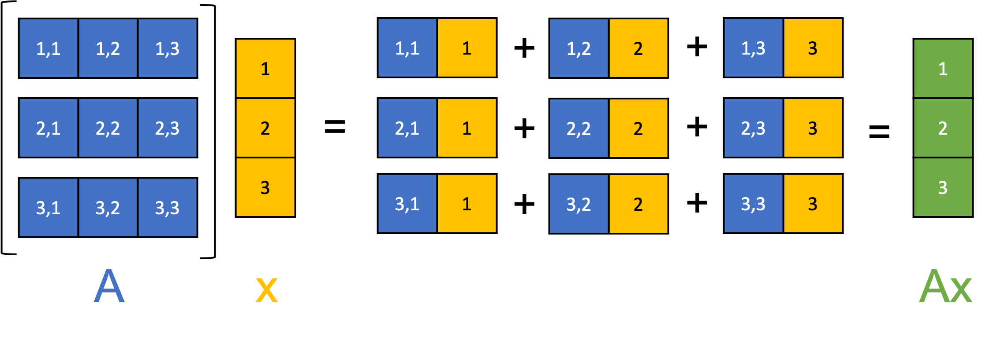

向量 **x**：

$x = \begin{bmatrix} x_1 \\ x_2 \\ x_3 \end{bmatrix}
$

矩阵 **W：**

$W = \begin{bmatrix} w_{11} & w_{12} & w_{13} \\ w_{21} & w_{22} & w_{23} \end{bmatrix}
$

相乘结果：

$y = W x = \begin{bmatrix} w_{11}x_1 + w_{12}x_2 + w_{13}x_3 \\ w_{21}x_1 + w_{22}x_2 + w_{23}x_3 \end{bmatrix}
$


**总结：**

- **前面的矩阵每一列，分别乘以后面矩阵的每一行，结果的行数由后面的矩阵的行数决定。**

- **相当于把前面的矩阵W，按照x的数值做线性放大，或者缩小，又或者是过滤，然后将数值求和映射到A的矩阵空间。**


### 向量点积

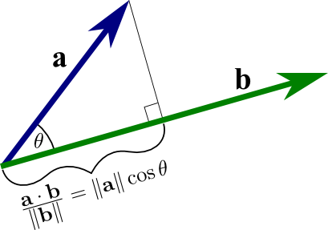

两个向量：

$a = [a_1, a_2, a_3], \quad b = [b_1, b_2, b_3]
$


点积：

$a \cdot b = a_1b_1 + a_2b_2 + a_3b_3
$


也可以写成：

$a \cdot b = |a||b|\cos\theta
$


**总结：**

- **两个向量的夹角越小，其点积越大，反之则越小，说明方向越相似的向量**

- **两个向量的点积越大，两个向量潜在的某种相关度也就越高。**


### SoftMax的计算方式

给定一组实数（logits）：

$z = [z_1, z_2, \dots, z_n]

$


Softmax 函数定义为：

$\text{Softmax}(z_i) = \frac{e^{z_i}}{\sum_{j=1}^{n} e^{z_j}}$


Softmax的性质：

- 每个softmax\(i\) \< 1

- 序列所有元素的softmax之和加起来等于1

- 保序性：序列原有排序，映射到softmax序列之后不变


**总结：**

- **softmax能把占比较大的值放大， 占比较小的值缩小，同时还能保持顺序，放大了差异，形成了竞争**

- **数值在0\~1之间能让训练的梯度稳定，不容易出现梯度爆炸，导致模型训练失败**


### 梯度下降法

#### 计算思路

假设我们要最小化一个函数  $J(\theta)
$  它关于参数 θ 的偏导数为 $\frac{\partial J(\theta)}{\partial \theta}$ 

梯度下降单次迭代的更新公式：

$\theta_{t+1} = \theta_t - \eta \frac{\partial J(\theta_t)}{\partial \theta_t}
$

其中：

- $\eta$：学习率（learning rate），控制每次“迈步”的大小

- $\frac{\partial J(\theta)}{\partial \theta}$ ：当前位置的梯度（斜率）

- $\theta_t
$：当前参数

- $\theta_{t+1}
$：更新后的参数


```Kotlin
J(θ)
│                ● ← 起点（随机初始值）
│              ●
│           ●
│        ●
│     ●
│  ●
└──────────────────── θ
             ↓
    每一步沿负梯度方向前进
```

每一次迭代，都朝着梯度下降的方向下降，逐步找到最小值，每次运算都取当前点的斜率（偏导数）作为下一轮计算的输入，逐步降低结果值，最终得到使函数结果（**损失函数**）变成最小值，或者接近于最小值。

实际的模型训练当中，参数通常都很多个（好几千万，甚至过亿），梯度下降的执行过程如下：


#### 梯度更新数学形式：

假设损失函数：

$J(\theta_1, \theta_2, \dots, \theta_n)$

梯度是：

$\nabla J = \begin{bmatrix} \frac{\partial J}{\partial \theta_1} \\ \frac{\partial J}{\partial \theta_2} \\ \vdots \\ \frac{\partial J}{\partial \theta_n} \end{bmatrix}
$


|梯度分量|含义|
|---|---|
|∂J/∂θ₁|θ₁ 往哪边改，loss 降得最快|
|∂J/∂θ₂|θ₂ 往哪边改，loss 降得最快|
|\.\.\.\.|\.\.\.\.\.|


梯度计算公式：

$\boldsymbol{\theta}_{t+1} = \boldsymbol{\theta}_t - \eta \, \nabla J(\boldsymbol{\theta}_t)
$


其中：

- $\nabla J(\boldsymbol{\theta})$是 **梯度向量**

- 每个分量是对一个参数的偏导数


**一句话总结：对所有分量都计算一次梯度，然后叠加起来得到一个总梯度，作用于整体的梯度值，然后完成这一轮学习的参数更新。**


#### **梯度权重：**

当我们需要让模型更加重视某些特征，参数类型的时候，我们可以对损失函数进行改造，提升重要参数在损失函数中的权重占比，使得模型训练的时候，这些参数的损失对整体结果造成的影响更大，当模型完成训练的时候，input中，这部分特征会对模型的行为造成更大的影响，模型会对这些特征更加灵敏。


$\mathcal{L} = \alpha \cdot \mathcal{L}_\text{重要} + \beta \cdot \mathcal{L}_\text{普通}
$


其中：

- $\alpha > \beta
$

- 重要部分对梯度贡献更大


### 小结

- 矩阵相乘决定我需要看什么维度的数据，是升维还是降维，还是过滤某部分数据。

- 向量点击决定了两个向量的相似度。

- SoftMax决定了，我对结果的关注度到底要有多少。

- 梯度下降法用来优化、迭代模型中的可训练参数


# Transformer架构

### 整体架构

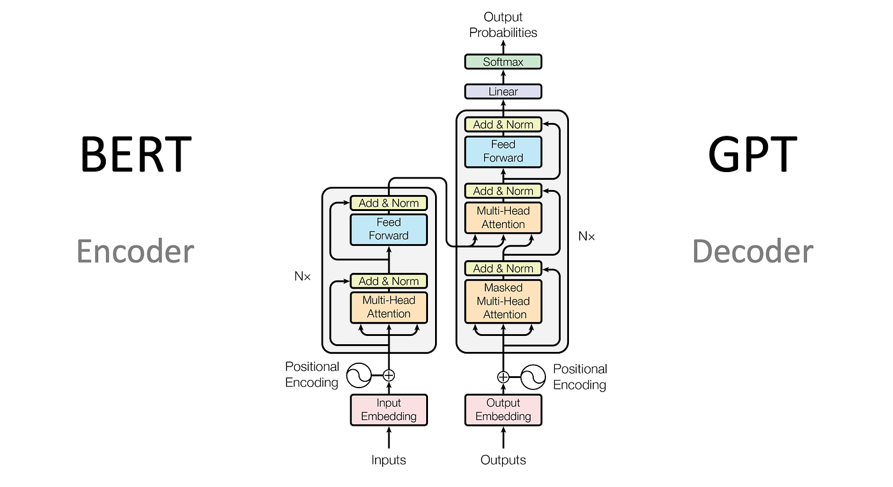

**一句话总结：Transformer 是一个完全基于注意力机制（Attention）的架构，不再依赖类似于 RNN / CNN 的时序结构。**


#### 主要解决的问题：

- **并行计算**：全序列执行attention自注意力计算

- **长距离的token可互相依赖**：Self\-Attention直接可以建立任何token之间的关系

- **记忆力较强**：attention直接动态聚合整个窗口的上下文


#### 各个模块简要介绍：

- **Inputs**：当前输入的token序列，包含上一次生成的结果

- **Input Embedding**：将token直接映射成一个固定的向量，向量长度512 \~ 12288不等，向量里面每个数值都代表某个特征值的强弱，比如 \[1, 0, 0\.5 \.\.\.\.\. \] 可以表示：开心程度：1，难过程度：0，兴奋程度：0\.5，

- **Positional Encoding**：对token向量做一个线性变化，使得每个token向量都带上其位置信息

- **Multi\-Head\-Attention**：让token向量直接互相看，互相计算多轮的相似度，同一句话，以每个token作为主题词，计算一次整体的相似度

- **Add \& Norm**：Attention计算结果会加上原始的token向量输入，然后再通过Norm做一个归一化，防止训练的时候梯度爆炸

- **Feed Forward**：对每一个token的Attention计算输出结果，做一个非线性变化，通过激活函数，使得模型在训练的时候，对token的注意力结果有自己的思考

- **Linear**：将多轮计算好的hidden\_state （最后一个token的计算结果）跟Embedding里面的每个token计算相似度，

- **SoftMax**：对计算出来的相似度做一个竞争归一化结算，打分较高的token，自然就会获得更高的概率

- **Output Probabilities**：对打分的结果进行挑选，例如贪心算法，sampling，top\-k，top\-p等方式


### 编码器与解码器

**一句话总结：编码器负责分析，解码器负责生成**

**编码器**：对输入的token做全局句子结构和语义理解

- 每个token都会对**整个序列**的所有token计算注意力结果

- 适合做理解**分析型任务**，比如图像理解，文本内容分析

**解码器**：拿已计算好的全部token attention结果，预测下一个token到底是啥

- 每个token只能关注在自己前面的所有token，后面的token无法感知到

- 适合做**生成型任务**，比如图形生成，文案生成，对话式AI


### Decoder\-only模式

由于解码器每次都要对全部序列重新计算注意力，资源开销非常大，所以在生成式任务的场景里面，只需要保留编码器即可完成生产，编码器每次也一样会计算序列的token，但每个token仅跟它前面的所有token计算注意力得分，所以每次计算结果都可以被缓存起来，也就是所谓的kv\-cache，当有了这部分缓存之后，每次只需要计算最后一个新的token的注意力结果即可。


#### Hidden\-state

第n个token的计算，需要依赖前面\[0, n\-1\]token的计算结果，同样的，第n\-1个个token，依赖前面\[0, n\-2\]的token计算结果，模型通过这种方式，让第n个token，隐式的叠加了前面所有token的“影子”，也就是已经包含了模型生成下一个token的所有信息，所以只需要依赖最后一个token的计算结果，就可以生成下一个token，同时下一个token如果不是结束符token，就会被作为输入，继续执行下一个生成流程


#### 自回归

模型生成一句话的时候，是一个一个token生成，除非token是结束符，不然每一个新的token都作为输入，当做下一次生成任务的第n\-1个token，每一个token的计算结果都会被缓存起来，所以下一次计算，只需要计算当前最后的一个token即可生成下一个token

```Plain Text
input 0: [我] [今天] [很]
round 0 compute : [我] [今天] [很] -> ?
output 0: [我] [今天] [很] **[开心]**

input 1: [我] [今天] [很] **[开心]**
round 1 compute: [我] [今天] [很] [开心] -> ?
output 1: [我] [今天] [很] [开心] **[，]**

input 2: [我] [今天] [很] [开心] **[，]**
round 2 compute: [我] [今天] [很] [开心] [，] -> ?
output 2: [我] [今天] [很] [开心] [，] **[可以]**

input 3: [我] [今天] [很] [开心] [，] **[可以]**
round 3 compute: [我] [今天] [很] [开心] [，] [可以] -> ?
output 3: [我] [今天] [很] [开心] [，] [可以] **[早点]**

input 4: [我] [今天] [很] [开心] [，] [可以] **[早点]**
round 4 compute: [我] [今天] [很] [开心] [，] [可以] [早点]-> ?
output 4: [我] [今天] [很] [开心] [，] [可以] [早点] **[下班]**

input 5: [我] [今天] [很] [开心] [，] [可以] [早点]** [下班] **
round 5 compute: [我] [今天] [很] [开心] [，] [可以] [早点]-> ?
output 5: [我] [今天] [很] [开心] [，] [可以] [早点] [下班] **[end]**
```

**疑问：为什么可以仅用最后一个token来间接包含前面的所有token？**

其实是因为token向量长度足够长，里面能够容纳的特征数值足够多，自然就能避免特征被压缩，失真，token向量的长度跟模型token窗口上下文长度有关。


# Token Embedding 嵌入

> 在人类的语言里面，每个词都可以查字典，然后找到对应的详细解释，同样的，在LLM模型里面，每个token都需要一个解释，这个解释不需要被人类弄懂，只需要模型形成一个映射表，即可
> 
> 

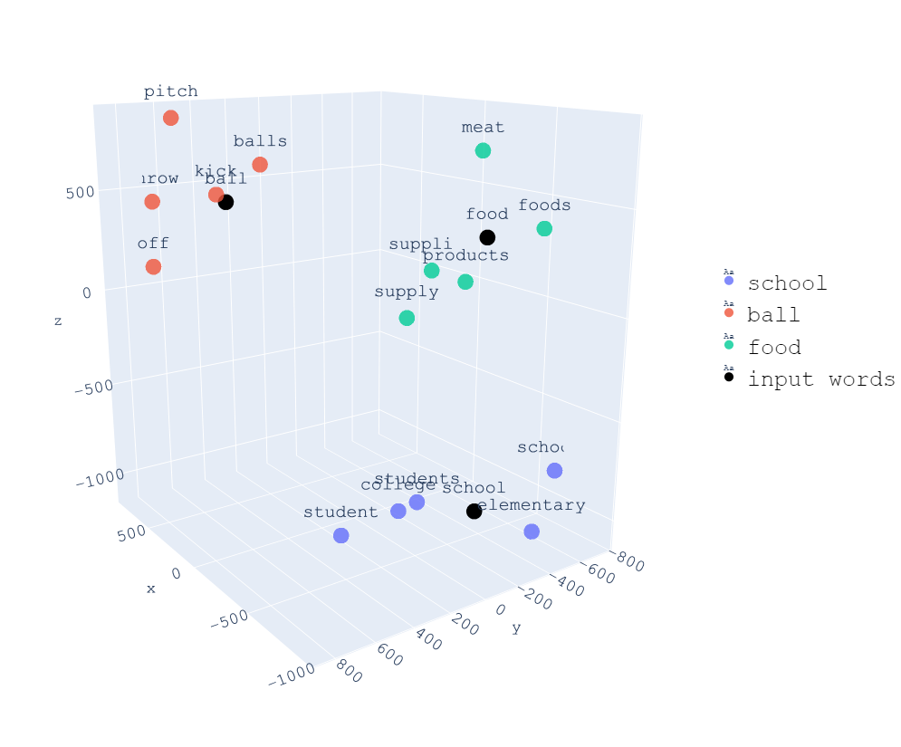

#### 三维空间的例子

假如把一个token用**三维向量**表示，那么一个token就是在三维空间上的一个点，这个点在当前的向量空间里面是**全局唯一的**，每个token都有自己独立的位置，相似的token，他们的坐标需要离得更近一点，就跟查字典一样，相似的词它们之间的坐标也会离得更加接近（这非常重要）

两个token的相似度，可以用它们坐标连接到原点的两条直线夹角来表示，如果角度接近0°，说明它们的相似度非常高，如果角度越接近90°，它们则越是正交关系，也就是所谓的八竿子打不着，如果越接近180%，说明它们的语义接近于相反。


#### 多维向量

一个词不只有3个维度，在人类的语言当中，一个词的意思可以有很多种，也就是特征有很多，以一只猫咪来作为例子：


假如一个token是上面的这只猫咪，经过embedding嵌入之后，就会转换为一个固定的向量映射，这个映射是固定的，每个token唯一对应着一个向量

```Kotlin
[0.95, 0.10, 0.99, 0.20, 0.85, 0.70, 0.15, 0.60, 0.50 ....]
```


#### 模型是如何生成Embedding嵌入映射的？

初学者会觉得很难理解，人类语言里面有这么多个词，每个词又有这么多个特征，难道要人为手动地制定这个词对应的所有特征吗？这工程量非常大，而且也不靠谱，每个人都有主观性，有的人认为某个特征该多一些，另外的人又觉得应该要少一些，很难形成稳定可靠的映射参数。

所以这里就需要让模型经过上亿次的训练，学会每个token的特征向量该如何设置，也就是说，token跟向量的映射表是模型在训练阶段，通过结果与预期的误差值，来反向传播梯度，来更新各个特征的值，逐步构建最终版的参数。


# 位置编码

位置编码的意义：只有token向量是不够的，一个token在句子的位置也是需要考虑的，比如“你爱我，我爱你，蜜雪冰城甜蜜蜜”，中间出现了两个“我”，两个“你”，两个“爱”，它们的位置都需要被模型感知到，不然语义理解就会出现问题，模型无法理解是只有你爱我，还是只有我爱你，还是说两者都有。


### 初版位置编码

初版的位置编码，是为了让token的向量带上位置信息，位置编码本身跟token无关，只跟位置有关，也就是说，“我”这个token，经过embedding之后，获得了一个固定的向量，然后再逐项相加，相当于每一次输入当中，出现在第5个位置的"我”，不管上下文是什么，得到的向量都是一样的、固定的。


#### 计算方式

**偶数位编码**：$PE(pos, 2i)   = sin(pos / 10000^(2i/d_model))
$
**奇数位编码**：$PE(pos, 2i+1) = cos(pos/ 10000^(2i/d_model))
$

其中，PE是位置编码向量，2i表示偶数位，2i \+ 1 表示奇数位，偶数位用sin函数，奇数位用cos函数

#### 可视化

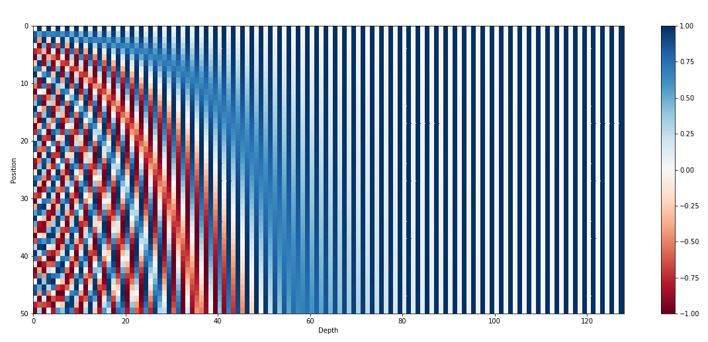

解释：

- pos：第几个token

- depth：位置编码向量中，第几个值，代表要对token embedding做线性变化的值

- 特性：奇数位，偶数位分别用sin, cos是为了以下目标：

    - 感知token的顺序，只需要增加或者减少一个固定的Δθ即可完成变化，让模型可以感知到前后相邻的区别，知道token的顺序，比如（爱你，你爱）有区别，并且是特定旋转角度。

    - 能感知远距离token的关系：两个token的位置编码向量的点积可以反映出两个token之间的距离


#### 计算例子

```Kotlin
Tokens:      我   爱   你
Embedding:  [e1][e2][e3]

Self-Attention 计算的时候，看到的是：
{ e1 , e2 , e3 }   ← 无序集合

**此时Attention看到的token：我 爱 你  ≈  你 爱 我  ≈  爱 你 我**

不同频率的正余弦波：

短周期波： ~~~~~~
长周期波： ~~~~~~~~~~~~~~~
更长周期： ~~~~~~~~~~~~~~~~~~~~~

叠加后 → 每个位置得到唯一的“波形指纹”

pos=1   ~~~—~~~—~~~—~~~
pos=2   ~~—~~~—~~~—~~~~
pos=3   ~—~~~—~~~—~~~~~
pos=4   —~~~—~~~—~~~~~~

token embedding:   [ 2.4, -1.2, 0.3, ... ]
position encoding: [+0.5, +0.1, -0.7, ...]

**最终输出**：
= token embedding + position encoding

**此时Attention看到的token：我带你 ！= 你爱我 ！= 爱你我**
```


#### 优势：

1. 提供连续可维的位置表示

2. Sin \+ Cos的函数组合成向量，能够确保方向 \+ 位置唯一

3. 实现了长、短距离的token依赖

    1. 相距较近的token，由于位置编码向量低频部分较为相似，所以点积越大，**跟注意力得分计算天然地吻合，模型自然会给更高的注意力得分，这跟自然语言中的规律更相关：挨得近的词自然关系更大**

    2. 相距较远的token，由于位置编码向量低频部分差异较大，所以点积较小，但它们的高频部分依然存在重合度较高的部分，**所以它们之间的点积不会被压缩成0，它们依然存在某种“联系”，模型依然可以学会它们之间的关系。**


### 旋转位置编码

#### 初版位置编码的局限性：

- 对于超长token序列的**外推性**会很差，比如32k，128k的token窗口，为了适配更长的长度，sin/cos的周期会被压缩，波形会坍缩，超出频率范围，attention会错乱

- 由于是向量直接的相加，模型难以区分计算的得分结果，更多来自于位置，还是来自于词义

- 编码值表达了绝对位置，但没表达相对位置，模型只知道Token A在第5个位置，Token B在第10个位置，但相差5个位置的这个计算则不好表达

- 序列前面多一个词，会导致整个位置编码变化巨大，模型会认为语义变化很大，但语义实际上是token之间的距离不变，语义就不变


#### 旋转位置编码：

旋转位置编码的引入，解决了绝对位置编码的局限性，使得模型能非常轻易地感知相对位置的变化，比如第1个token，跟第1000个token的距离

旋转位置编码保留token原始的embedding进入注意力qkv的计算，然后对qk进行旋转，选择的时候，对向量进行切割，每两个特征为一组，从第一组开始，到最后一组，旋转点击角度越来越大，就像旋转编码器

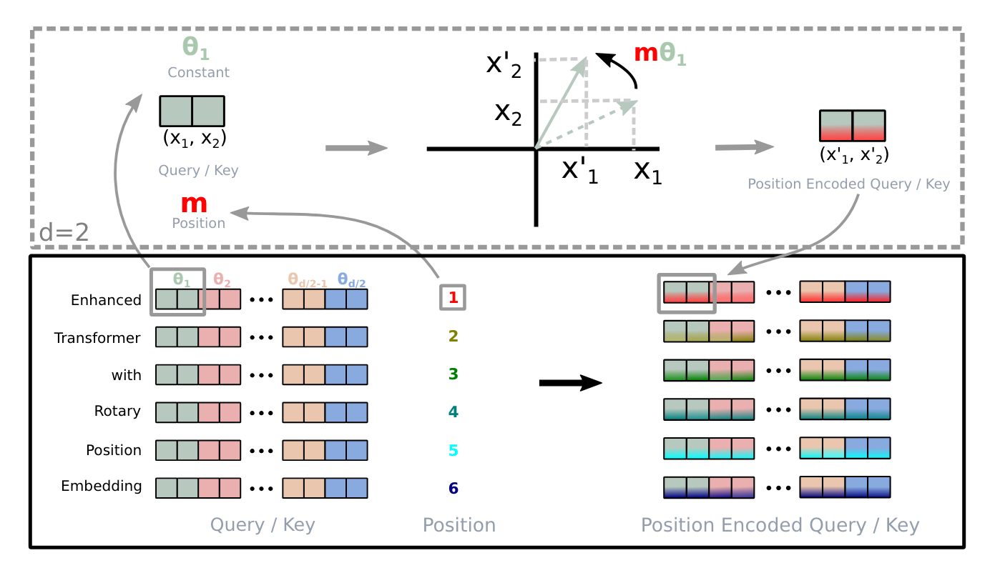


图片说明：

1. 每个token都根据所处的位置，分配一个初始的旋转角度θ

2. 每个token的特征，两两分割，分别旋转θ \* i的角度

3. 旋转的方式，第一个token乘以sinθ，第二个token乘以cosθ

4. 仅对Query, Key向量做计算，不对原始的embedding token计算


这样做之后，相对位置可以通过两个向量的点积大小来表达，绝对位置也能在向量中体现出来，还能支持更长的序列，因为角度可以无限地旋转。


# 注意力机制

> LLM的核心机制 \-\- 注意力 
> 
> 

### 注意力机制

这是论文里最核心的一行公式：

$\text{Attention}(Q, K, V) = \text{softmax}\left(\frac{QK^\mathsf{T}}{\sqrt{d_k}}\right)V
$


#### Query, Key, Value的含义

一个简单的例子

预测180身高的体重，结合当前已有的数据样本（Key），计算相关度的方式则是两个向量计算点积得到相似度得分，每个得分再乘以对应的样本体重（Value），加权求和得到一个预测结果

- Q：token的embedding向量作为query的向量

- K：token的embedding向量作为查询key的向量

- V：token的embedding向量被查询时的结果


#### 公式算法的含义

- $QK^\mathsf{T}$：计算结果就是注意力原始得分，QK向量计算点积：Q作为问题，K作为线索，意味着线索能够为问题提供多大的相关度，点积越大，说明向量的相似度越高，线索提供的作用越大，模型更应该关注token所提供的线索。

- $\sqrt{d_k}
$：除以一个数值，避免注意力数值过高，让softmax不要变得太尖，不过饱和

- ${softmax}
$：多个key的注意力得分计算softmax，得到注意力权重

- $V
$：token的K向量对应的查询结果value，意味着线索对应的宝藏


### QKV是如何计算得来的？

对于一个token embedding之后的向量x，模型通过投影的方式，将向量投影成另3个向量：

$Q = x W_Q,\quad K = x W_K,\quad V = x W_V
$

而这里的Wq, Wk, Wv，都是模型训练出来的矩阵，相当于模型自己学会了如何将一个向量，映射成q，k，v向量，形象一点说，就是模型学会了怎么得到这个token的三个要素：

- 我拿到这个token，要关注什么（Query）

- 我拿到这个token，可以为哪些token提供线索（Key）

- 我拿到这个token，可以为其他token提供什么结果（Value）


### 自注意机制

LLM之所以能吊打传统的模型，毫不夸张地说，全靠自注意力机制，才能得以能实现全文本的并行计算，计算自注意力的时候不依赖文本顺序，直接拿所有token，跟其他所有token计算一次注意力结果。

每个 token 通过自己的 Query 与所有 token 的 Key 计算相关性分数，并通过 softmax 得到注意力权重，再对所有 token 的 Value 向量加权求和，得到融合上下文的新表示。

自注意力层可以堆叠多层网络，多轮计算的过程使模型逐步从“局部依赖”过渡到“全局语义理解”，最终形成表达整句含义的高级语义向量。

##### 一个简单的例子

##### 总结：

- 每一轮注意力计算结果都要经过**Feed\-Forward**，带上模型对语义结构的理解之后，再重新进入下一轮的计算

- 第一轮计算之后，模型学会了“我”这个token会更多关注“今天”（因为离得近，位置编码的内积更大，自然更容易得到更高得分）

- 第二轮计算之后，模型学会了“我”这个token会带上一个“开心”的状态，模型理解了我 \+ 时间 \+ 情绪的结构

- 第三轮计算之后，由于第二轮计算结果模型学会了“开心”前面被“很”修饰，所以更加肯定“我”这个token在今天很开心

- 第n轮计算之后：模型在离“我”这个token位置更远的地方找到“我”因为什么而开心，而“开心”这个token，自然也会跟整个语义结构关联起来

- 经过多轮计算的向量结果，表示为**hidden\_state**，意味着这个向量已经包含了关注这个token在整个上下午内的整个语义的信息


### 多头注意力机制

实际的模型计算的时候，会把长度为12288维的embedding向量拆分为多个片段，每个片段的长度都固定，每个头的输入都是固定长度的向量，每个头关注的侧重点不一样，相当于Head0只关注0 \~ 96维度特征的注意力，Head1只关注97 \~ 192维度特征的注意力，以此类推，这样可以极大地提高计算速度，以及训练效率。

##### 图例

##### 总结：

1. Split: 每个token都会被拆分为128个96维向量，每个向量代表这个token的96个不同的特征值

2. 每个Head都有自己的Wq, Wk, Wv映射矩阵，这些矩阵各不相同，意味着每个split之后的特征，输入到这些Head里面，都会被转化成不同的Q、K、V，然后计算多轮的注意力，得到注意力结果。

3. Concat: 多个Head的计算完成之后，会被合成为一个result向量，里面包含了模型对这个token关于整个上下文的所有理解


# Add \& LayerNorm 残差连接

在训练深度神经网络的时候，一直有个老问题：网络的层数一边多，信息从前往后传的时候就会逐渐失真，就像我们人类玩后背画画的游戏是一样的，一开始的消息，传到最后一个人的时候，已经失真了，模型训练也是一样的，每一层对注意力结果都有自己的理解，一旦中间出现理解偏差，训练就很容易失败。

残差连接就是为了把原始信息补上，避免经过多层训练之后，模型逐渐失真（喝醉 \+ 幻觉）

### Add \& LayerNorm的位置

### Add的计算方式

```Kotlin
原始数据：x

attn_out = SelfAttention(x)      # 子层输出
y       = x + attn_out           # Add（残差连接）

下一层的输入：y
```

- 某一层的attention \+ FFN 可能学得不好，很多数值接近于0，那把原始的x加进去，让下一层学习至少不会比之前更差

- 如果子层学得好，那attn\_ouot就是在原来结果的基础上**修生/增强**


### LayerNorm

对token输出结果的每个特征维度，都做一个**标准化 \+ 线性变化**，这一步的目的是为了不要让某些参数过大，某些参数过小，而是让参数都重新分布在某个范围里面，对梯度训练更加友好，避免梯度爆炸的情况。


1. 按**特征维度**求均值：

$\mu = \frac{1}{d} \sum_{i=1}^{d} h_i$


2. 按特征维度求方差：

$\sigma^2 = \frac{1}{d} \sum_{i=1}^{d} (h_i - \mu)^2$


3. 标准化：

$h^i=\frac{h_i - \mu}{\sqrt{\sigma^2 + \epsilon}}$


4. 再乘一个可学习的缩放 $\gamma_i$和偏移 $\beta_i$：

$\text{LN}(\mathbf{h})_i = \gamma_i \cdot \hat{h}_i + \beta_iLN(h)$


### Add \& LayerNorm的核心作用：

- **保证每一层都能看到“干净、分布稳定”的输入**

    - LN 每次把向量拉回均值 0、方差 1 左右，再通过 γ、β 调整尺度。

    - 深层网络里，如果没有这种归一化，很容易出现某一层数值放大/变得极小，训练直接炸掉或停滞。

- **Add 让子层只需学“增量修正”**

    - 自注意力子层输出的是“在原语义上的偏移 \+ 补充”，而不是从零开始重新构造一个含义。

    - FFN 子层也是在“上一层已经聚合好的语义表示”基础上做更非线性的抽象。

- **梯度可以穿越很多层而不衰减太快**

    - LN 的参数 γ、β 也能被训练成合适的尺度，避免梯度爆炸/消失。


# FFN \-\- Feed Forward前反馈网络

### 存在的意义

模型之所以能“学会”，不是因为Attention，靠的是FFN，也就是神经网络，单纯只有注意力计算是无法让模型学会语义的，注意力只是把已有数据重新分配重要性，只是线性加权的组合的信息重排，不具备创造复杂特征的能力。

FFN的存在则是解决了“谁比谁更重要”，“重要的信息要如何表达”

### FFN数学过程

Transformer 里的经典 FFN 公式：

$FFN(x)=\text{Linear}_2(\sigma(\text{Linear}_1(x)))
$

展开：

1. 线性层 1：升维

$xW_1 + b_1$

2. 非线性激活：

$\sigma = \text{ReLU / GELU / SwiGLU}$


3. 线性层 2：降维

$\sigma(\cdot)W_2 + b_2$


#### 计算流程示意图

##### 参数说明：

- **W1, b1**：向量升维参数，这一步叫做非线性映射，可以参考图片、视频压缩算法里面的量化矩阵，只是这个地方反而是升维

- **W2, b2**：对向量进行降维，同样是非线性映射，将经过激活函数处理之后的向量降维输出

- **W1, b1, W2, b2是怎么来的？：**一开始是初始化的，模型训练的时候通过梯度不断地更新调优得来的

- **升维的含义**：将一个向量，映射成更高维度的向量，可以理解为丰富一个特征集合的特征数量，比如原本只有`[职业, 性格]`两个特征的集合，映射到了 `[技术工种，商务工种，工作技术复杂度，工作社会贡献度，开朗程度，孤僻程度，自恋程度，嫉妒心程度] `的8个特征的集合，让模型对结果有更高维度的学习

- **降维的含义**：降维则是将经过激活函数处理过后的数据，重新聚合成旧的特征集合，使得输出的结果带上了模型自己的理解，而不是仅仅只有注意力的线性变化结果。


### FFN在模型计算中的位置

#### 总结

- 每个Head计算完以后，模型会把每个Head的结果Concat起来，然后输入给FFN

- 每一轮的FFN都不一样，意味着模型对每一轮的Attention输出，学习重点都不一样。

- 每一轮FFN的结果，都会提供给下一轮的Multi\-Head作为输入

- 经过多轮的计算，模型输出的结果包含了对语义的所有理解


# 激活函数存在的意义

### 常见激活函数

|函数|作用|数学公式|图像|
|---|---|---|---|
|ReLU|小于0截断，稀疏表达<br>小于0的统统滚蛋，训练的时候梯度下降非常快<br>|$\text{ReLU}(x)=\max(0,x)$<br>|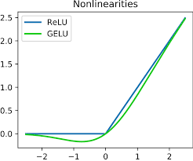<br>蓝色部分：<br>- 0以下：等于0<br>- 0以上：保留数值本身|
|GELU|近似正态门控，更平滑<br>模型会表现得更加聪明：我考虑一下是否要留，留多少，更加平滑<br>|$\text{GELU}(x)=0.5x\left(1+\tanh\left[\sqrt{\frac{2}{\pi}}\left(x+0.044715x^3\right)\right]\right)$<br>|<br>绿色部分：<br>- 0以下：渐渐靠近0，不是那么快变成0<br>- 0以上：渐渐靠近数值本身|
|Tanh|零中心激活，输出范围在 \(\-1, 1\)，能把过大的正负值压缩到稳定区间。<br>相比 Sigmoid，它保留正负号，优化通常更友好；但两端仍会饱和，深层网络里依然可能出现梯度变小。<br>|$\tanh(x)=\frac{e^x-e^{-x}}{e^x+e^{-x}}$<br>值域：\(\-1, 1\)，且 tanh\(0\) = 0。<br>|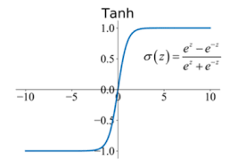<br>图像特征：<br>- 标准 S 形曲线，关于原点中心对称。<br>- x = 0 时经过原点，中心段最陡。<br>- x \-\> \+∞ 时逐渐逼近 \+1；x \-\> \-∞ 时逐渐逼近 \-1。<br>|
|SwiGLU|大模型常用，更强表达<br>模型的表现：<br>- 负数会比GeLU留得更多一些<br>- 比GELU有更好的**表达能力**，更稳定的训练，更好的梯度流动，参数更加高效<br><br>**很多团队做了大量实验，发现 SwiGLU 在同样算力下更好，于是成为主流。**|公式：<br>$\text{SiLU}(x)=x\cdot\sigma(x)$<br>其中:<br>$\sigma(x)=\frac{1}{1+e^{-x}}$<br>|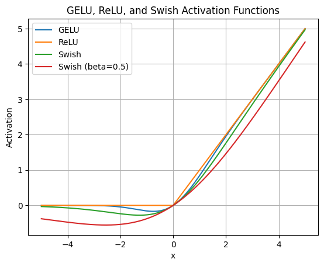<br>绿色部分：<br>- 0以下保留一部分：<br>- 0以上：渐进得线性|

#### 

### 做个简单的实验

|[train\_test\.ipynb](../assets/llm-foundations/train-test.ipynb)<br>实验流程：<br>1. 生成一些随机的数据，包含各自的类型<br>2. 构造一个多层网络，将网络训练得学会如何根据类型区分这些数据<br>3. 用不同的激活函数分别训练一次<br>4. 评测多层网络的性能（学习结果，学习效率）<br>|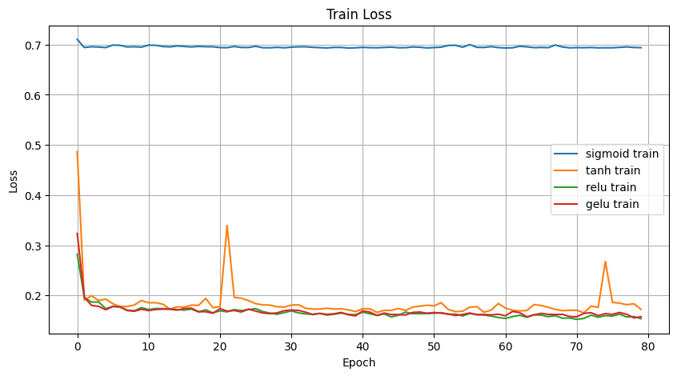<br>Train Loss（损失函数）<br>**训练集上的损失怎么随 epoch 下降**<br>**sigmoid** 那条线几乎一直趴在 `0.693` 左右<br> 这意味着它基本没有真正学到东西。<br> 二分类里，`0.693 ≈ -log(0.5)`，接近“瞎猜”。<br>**tanh / relu / gelu** 都在前几个 epoch 很快降到 `0.15 ~ 0.2` 附近<br> 说明它们都能优化这个任务。<br><br>Train Loss 反映模型在训练集上的拟合能力。<br>sigmoid 几乎无法把 loss 压下去，说明深层网络在这个设置下优化失败；<br>tanh、relu、gelu 都能快速下降，说明它们能有效支持反向传播和参数更新。|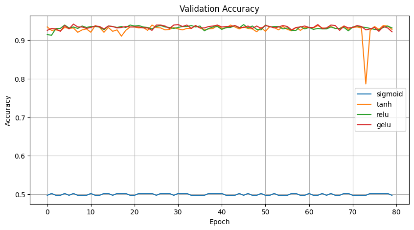<br>Validation Accuracy（准确率）<br>**验证集准确率**<br>- **sigmoid**：一直在 `0.5` 附近<br> 等于随机猜<br>- **tanh / relu / gelu**：都在 `0.92 ~ 0.94` 左右<br>这张图的意义是：**模型到底学会了没**<br><br>Validation Accuracy 说明模型是否真正学到了输入和标签之间的非线性关系。<br>sigmoid 的准确率长期停留在 50% 左右，说明优化过程已经失败；<br>tanh、relu、gelu 都能达到较高精度，说明这些激活函数更适合这个深层 MLP 任务。|
|---|---|---|
|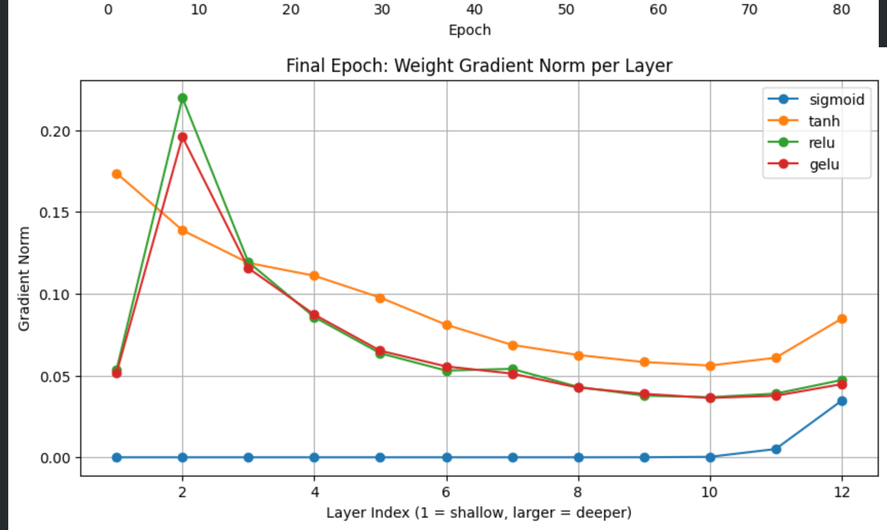<br>Final Epoch: Weight Gradient Norm per Layer<br>每一层线性层参数 `W` 的梯度范数大小<br>横轴：<br>- layer index<br>- 1 是浅层，越往后越深，12 是最靠近输出层<br>纵轴：<br>- gradient norm<br>- 越大表示这一层参数在当前还能收到更强的更新信号<br>**sigmoid**：前面大部分层几乎贴近 0，只有最后几层稍微有点梯度，这非常典型，就是 **梯度传不回去**<br>**tanh**：浅层有较大梯度，往深层逐渐衰减<br> 说明它也存在梯度衰减，但没 sigmoid 那么严重<br>**relu / gelu**：整体更平滑，很多层都还能拿到非零梯度<br> 说明梯度传播更通畅<br><br>如果前面层的 weight gradient norm 非常小，就说明这些层几乎没有被训练到。<br>sigmoid 在浅层梯度接近 0，意味着更新信号被严重削弱；<br>relu 和 gelu 在更多层都保持了可观梯度，因此更容易训练深层网络。|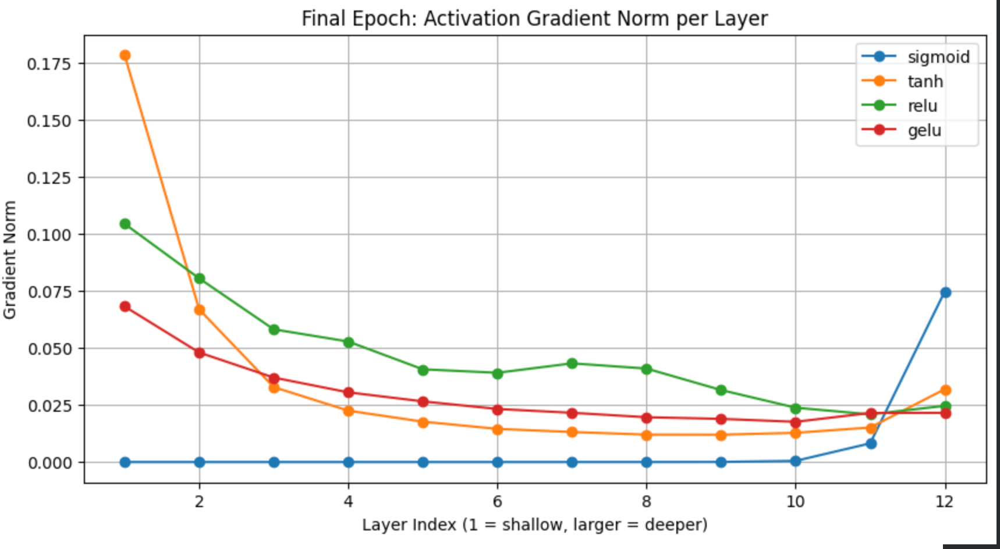<br>Final Epoch: Activation Gradient Norm per Layer<br>每一层激活输出张量的梯度范数<br>反向传播时，误差信号经过每层激活函数之后，还剩多少。<br>**sigmoid**：除了最后几层，前面层几乎是 0<br> 这非常直观地表现出“梯度在层间传播过程中消失”<br>**tanh**：前面有梯度，但往后快速变小<br>**relu / gelu**：整体衰减没那么夸张，梯度能传播到更多层<br><br>Activation Gradient Norm 更直接地反映了**误差信号**穿过各层非线性函数之后的衰减情况。<br>sigmoid 的激活梯度在多数层几乎为 0，说明梯度在传播过程中被大量压缩；<br>relu 和 gelu 则保留了更多可传播梯度。<br>||
|#### weight\_grad\_norms 参数权重热力图<br>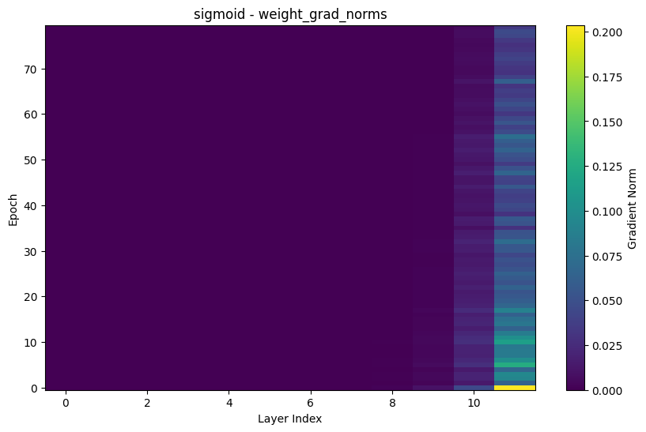<br>#### sigmod<br>- 大部分层长期发黑<br>- 只有最后几层稍亮<br>这说明：<br>- 训练从头到尾，浅层都几乎没怎么被更新到<br>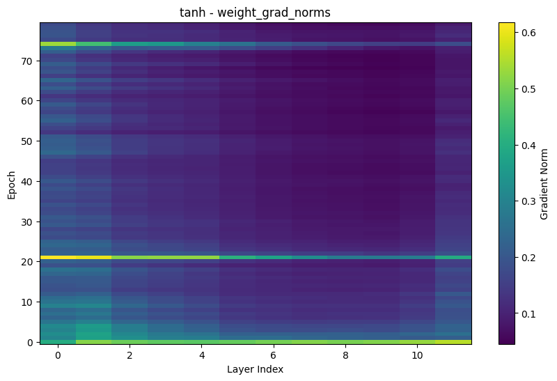<br>#### tanh<br>- 前面几层能看到比较明显的亮色<br>- 后面逐渐暗下来<br>说明：<br>- 可以训练<br>- 但仍有随层数传播逐步衰减的问题<br>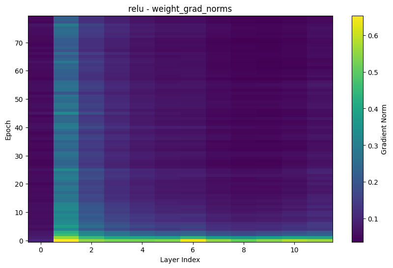<br>#### relu<br>- 亮区覆盖更广<br>- 梯度并不是只集中在最后一两层<br>说明：<br>- 训练过程中更多层持续得到有效更新<br>- 但偶尔也有训练梯度突刺不均匀的情况<br>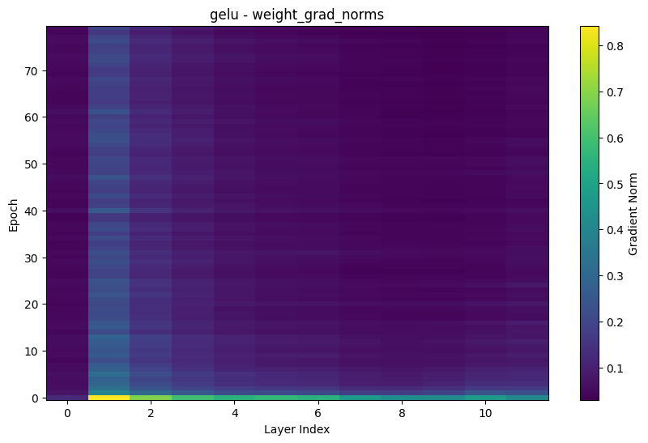<br>#### gelu<br>- 亮区覆盖更广<br>- 梯度并不是只集中在最后一两层<br>说明：<br>- 训练过程中更多层持续得到有效更新<br>- 梯度分布非常均匀，模型表达能力更强<br>#### weight\_grad\_norms热力图<br>展示了整个训练过程中各层参数梯度的时序分布。<br>sigmoid 的亮区主要集中在靠近输出的层，说明浅层长期几乎收不到训练信号；<br>relu 和 gelu 的亮区分布更广，说明更新信号能更稳定地覆盖深层网络。<br>|||
|#### Activation\_grad\_norms 激活输出的梯度<br>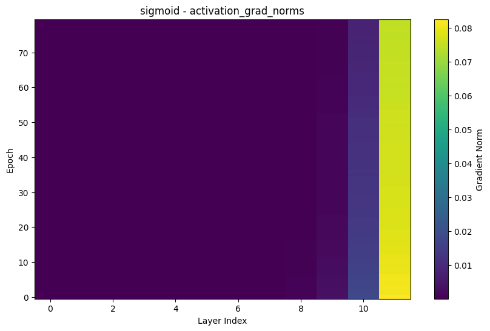<br>#### sigmoid<br>几乎整张图前面都很暗，只有最后侧较亮<br>这是最标准的“梯度消失”视觉证据之一。<br>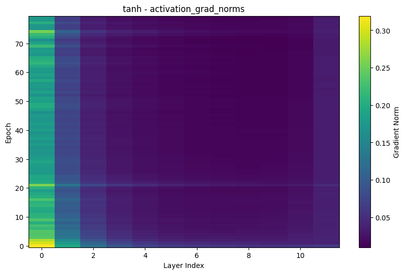<br>#### tanh<br>比 sigmoid 好很多，但仍能看到明显衰减带<br>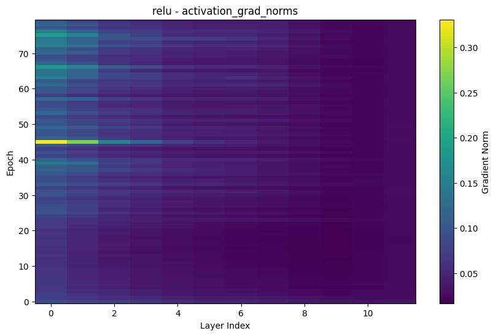<br>#### relu<br>梯度在更多 epoch、更多层上都保持可见强度，但偶还是出现了一条梯度强度不平滑的尖刺<br>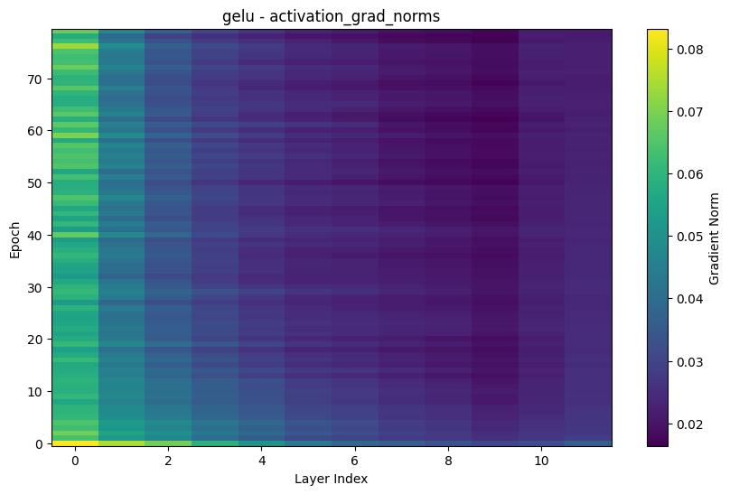<br>#### gelu<br>梯度在更多 epoch、更多层上都保持可见强度<br>这组图说明，不同激活函数的核心差异，不只是最终准确率，而是它们对反向传播信号的保留能力不同。<br>sigmoid 最容易让梯度在传播中衰减；relu 和 gelu 更容易维持深层可训练性。<br>|||
|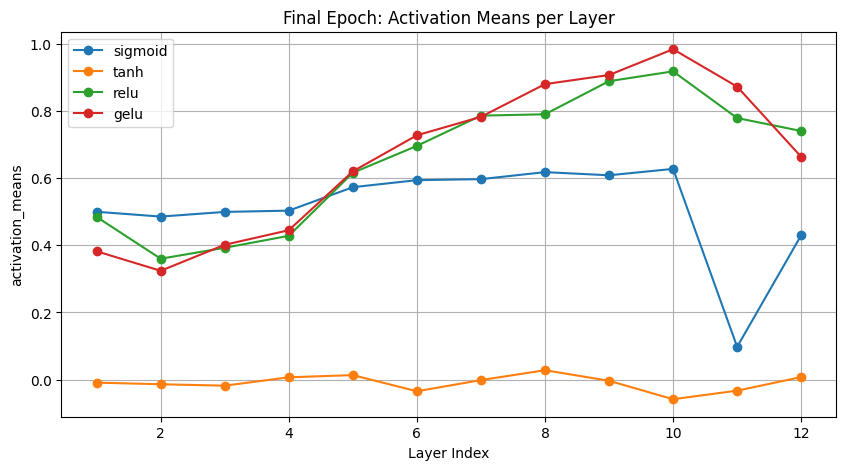<br>#### 每层激活输出的均值<br>**sigmoid** 的均值大多在正数区，且比较集中<br> 这符合 sigmoid 输出在 `(0,1)` 的特点<br>**tanh** 的均值更接近 0 附近波动<br> 这就是它比 sigmoid 更“零中心”<br>**relu / gelu** 的均值通常更大，而且随层变化明显<br> 因为它们对正半轴保留较多响应<br><br>如果某层激活输出长期挤在某个很窄的范围，或者整体偏移很严重，就容易出现：<br>- 表达能力不足<br>- 饱和<br>- 梯度变弱<br><br>Activation Mean 反映每层神经元输出是否偏向某个固定区间。<br>sigmoid 输出天然落在 0 到 1 之间，层数加深后更容易整体偏向某些区间，从而造成饱和；<br>tanh 的零中心特性通常更利于优化；<br>relu 和 gelu 会保留较强的正向响应。<br>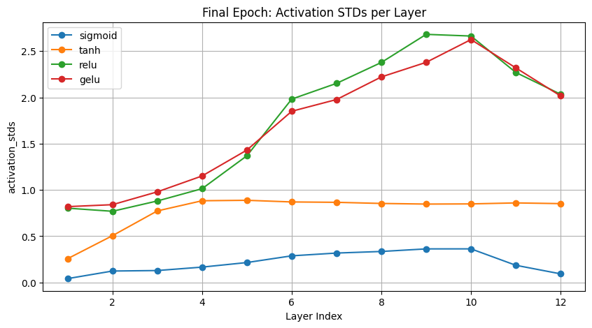<br>#### 每层激活输出的标准差<br>- 这一层输出是不是“有变化”<br>- 还是都挤在差不多的值附近<br>- 标准差太小：说明输出分布很窄，神经元区分度不强<br>- 合理的标准差：说明不同样本通过这一层后仍保留了区分能力<br><br>- **sigmoid** 的 std 整体偏小<br> 说明输出比较挤，容易饱和<br>- **tanh / relu / gelu** 的 std 更大<br> 说明层输出更有动态范围<br><br>如果激活输出分布过窄，很多神经元会落入导数很小的区域，导致梯度在反向传播中不断缩小。<br>sigmoid 的激活标准差较小，正是这种现象的一个侧面表现。<br>|||
|#### 决策边界图 \- Decision Boundary<br>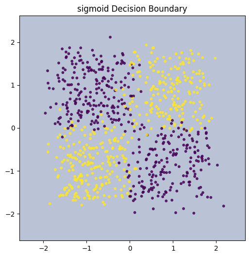<br>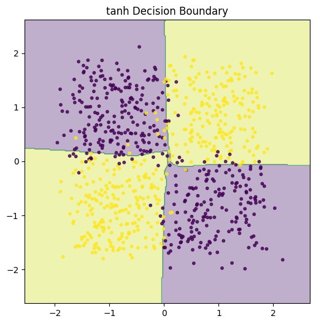<br><br><br><br>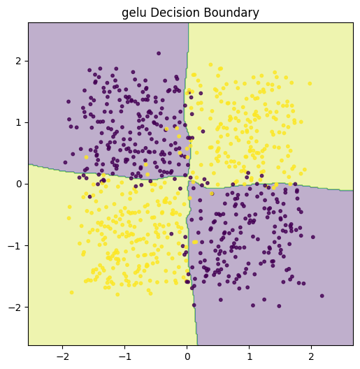<br><br>#### sigmoid Decision Boundary<br>sigmoid 图几乎就是：<br>- 一整块简单分区<br>- 没有学出 XOR\-like 的四象限结构<br>这说明：<br>- 模型没有学到任务里的非线性关系<br>这和前面的 loss / acc / 梯度图完全一致。<br>#### tanh / relu / gelu Decision Boundary<br>这三张都明显学出了：<br>- 类似四象限的分界<br>- 和 XOR\-like 数据标签是对应的<br>说明：<br>- 模型确实学会了这个非线性分类任务<br>其中：<br>- **relu / gelu** 的边界通常更利落<br>- **tanh** 也可以学出来，但内部优化过程没那么轻松<br><br>|||


### **让更深层的网络更容易被训练**

好的激活函数不会让梯度在反向传播时过快消失或异常放大，所以前面的层也能收到训练信号。 否则网络一深，前面很多层几乎学不到东西。

类比背传背的你画我猜


### **让梯度能够更稳定地在各层之间传播**

> 好的激活函数可以改善梯度传播质量，让不同层都保持较好的可训练性。
> 
> 

- 提高各层的**可训练性**

- 让各层都能收到**有效梯度**

- 让优化过程更稳定


### **让神经元和参数更有效地参与表示与更新**

> 好的激活函数能让更多神经元保持“活跃且可更新”的状态，从而提升模型表示能力和参数更新效率。
> 
> 


激活函数本身**不是直接提高参数利用率**，而是通过下面这些机制间接做到的：

- 避免大量神经元进入饱和区，导数接近 0

- 避免很多神经元长期输出几乎一样的值

- 让更多神经元在不同输入下产生有区分度的响应

- 让这些神经元在反向传播时也能拿到梯度


### 总结

1. 提升深层网络的可训练性，缓解梯度消失或梯度爆炸

2. 改善各层之间的梯度传播，使更多层都能获得有效更新

3. 提升神经元的活跃度与非线性表达能力，让更多参数真正参与建模


# Linear线性层

模型经过多轮的计算，输出的最后一个token的Hidden\_state，里面已经包含了要生产下一个token的所有要用的特征信息，将计算结果，跟embedding词表每一个词都做一个相似度计算，所有相似度结果再经过SoftMax，就能得到概率最高的前几个的候选token。

这一步的目的，就是将Attention语义空间的向量，转换成Embedding词表语义空间的向量，才能给模型做进一步的输出。


### 计算过程

1. 将hidden\_state转化为embedding向量

公式：

$y = Wx + b$

其中：

- $y$: 输出的向量

- $W$: W是模型的线性变化矩阵，负责将hidden\_state转化为输出向量

- $x
$: 多头注意力计算后的结果

- $b$：偏置

- b，W矩阵都是需要训练才能得到的参数，也就是说模型通过多次的训练学会了怎么将hidden\_state转化为一个语义空间的向量


2. 转化结果跟Embedding词表所有向量计算点积，再经过softmax输出每个token的概率


### 总结

这一步桥接了模型注意力计算层与结果输出层，将模型在注意力语义空间所理解的结果 \-\- Hidden\_State，转化成词表语义空间的向量token，为后面的结果输出提供数据。


# 结果输出层

### 结果评分算法

前面的Linear层已经把下一个是哪个token的概率分布输出了，接下来就是需要选取结果作为输出了，选取的算法通常有以下几种：

|方法|特点|
|---|---|
|Greedy|直接选概率最大的|
|Top\-k|只保留前k个，然后随机挑选|
|Top\-p\(nucleus\)|保留累计概率达到p|
|Temperature|控制随机性|


训练的时候，往往采用Greedy来让模型学会如何生成概率最大的token，计算交叉熵Loss的时候可以这样计算：

- 预测正确：奖励

- 预测偏差：惩罚

- 反向传播Loss \-\> 更新参数


### 模型结果蒸馏（老师学生模式）

存在的意义：大模型很准，但是计算较慢，小的模型很快，但是不够聪明，所以小模型可以通过知识蒸馏的方式，拿大模型结果层的的输出，跟自己的结果层输出，计算一层交叉熵损失，然后反向传播，这样可以让模型快速学习到另外一个模型的参数

暗知识：从概率分布，学到词与词之间的相关度，从而加速整个模型训练的效率

这一轮学习，小模型学到的知识：

- 猪的概率应该更高

- 狗的概率应该更低

- 猪跟狗的差别比较大

- 香蕉跟猪、狗的差别巨大，简直离谱


通过上述的知识，计算出对应的Loss，可以极快地提高模型的训练效率，小模型不单只学到了概率分布，还从概率分布里面看出，哪些词之间关系大，哪些词之间差距非常大，DeepSeek就是使用这种方法，加速了模型训练的过程。


# 输入prompt然后生成一段文本的过程

- prompt：**我今天很开心，因为吃到了好吃的，还有**

- 第一轮输出概率分布：喝了（0\.6），吃了（0\.3）\.\.\.\. 哈哈（0\.01）

- 第一轮的输出采用Greedy\-pick算法：喝了

- 第二轮的输入：**我今天很开心，因为吃到了好吃的，还有喝了**

- \.\.\.\.\. 

- 不断地自回归，直至模型生成了结束符token，生成完毕


中间用到了key\-value\-cache，跟传统意义上的kvCache不同，这里的key，是每个Head对token所计算出来的Key向量，跟Value向量，这些在下一次输入中都可以复用，大大降低了计算量。


# 大模型训练的方式

模型的架构已经固定了，整个计算过程也定型了，作为初学者总是很好奇，哪些参数都是怎么来的，难道是算法工程师一一设定的吗？在机器学习领域，模型的参数对于人类来说其实就是一个黑盒，人类也无法理解为什么参数要这么设定，这些参数是模型经历了九九八十一难，不断地被损失函数拷打，修改，循环往复所得到的结果，参数对于训练结果的预测达到了顶峰，说明宝剑（参数）已磨炼成功，随便任意输入，都无所畏惧！


### 待训练参数

整个模型，待训练的参数非常多，gpt 3\.0的参数多达1750亿的参数

- token向量长度：12288

- Embedding矩阵参数数量：6亿

- Multi\-Head\-Attention参数矩阵数量：6亿 \* 层数（96层）

- FFN前反馈网络参数数量：12\.1亿 \* 层数（96层）

- Linear层参数：6万，可忽略不计


### 损失函数

gpt训练的时候使用的损失函数是：**自回归语言模型的负对数似然（NLL）**


$L=-\log(p_{\text{true}})$


假设一轮训练的过程如下：

```Kotlin
输入：我今天很开心，
下一轮的答案：我今天很开心，因为

**情况1：**
模型输出：啊 （0.6），好 （0.3），因为（0.1）

正确答案：因为
正确 token 概率 p = 0.1（与情况1相同）
交叉熵损失：L = -log(0.1)
结果：L ≈ 2.302
说明：虽然表面输出不同，但 loss 只取决于“因为”的概率 → 同样很大

**情况2：**
模型输出：因为 （0.6），好 （0.3），啊（0.1）
正确答案：因为
正确 token 概率 p = 0.6
交叉熵损失：L = -log(0.6)
结果：L ≈ 0.511
说明：模型预测正确而且信心较高，loss 较小，但不为0（仍有不确定性）

**情况3：**
模型输出：因为 （0.9），好 （0.09），啊（0.01）
正确答案：因为
正确 token 概率 p = 0.9
交叉熵损失：L = -log(0.9)
结果：L ≈ 0.105
说明：模型对“因为”非常自信（90%），loss 非常非常小

```

可以看到，在模型的输出里面，找到正确答案的概率，然后再代入到\-Log\(x\)函数里面计算，就是损失得分。


### 反向传播梯度

当我们有了Loss损失函数以后，我们就可以依据一个理论来办事情：**谁把概率提高了，就奖励谁，反过来，谁把概率压低了，就惩罚谁**

#### 数学过程

Loss 定义：

$L = -\log p_{\text{true}}$


对$p_{\text{true}}$求导：

$\frac{\partial L}{\partial p_{\text{true}}} = -\frac{1}{p_{\text{true}}}$


正确的概率越大，梯度越小，反之，梯度越大

交叉熵 \+ softmax 的结果：

$\frac{\partial L}{\partial z_i}=p_i-y_i$


其中：

- $p_i$:模型预测概率

- $y_i$:真实 one\-hot 标签

    - 正确：1

    - 错误：0


当模型预测的正确结果$p_i$较大，接近1的时候，再减去1，得到的梯度是负数，也就是告诉模型这会处于**梯度下降法**的下山方向，方向是对的，应该得到奖励。


更新参数的方式（优化器）：

$W_{\text{new}} = W_{\text{old}}-\eta\frac{\partial L}{\partial W}$


其中$\eta$是模型的学习率，也就是学习步长，是一个正实数


#### 更新参数的顺序


### 如何训练

训练生成式模型，有一个很关键的点，就是不能让模型看着答案来生成，不然Loss会很低，模型根本就没学会语言结构，而是用偷看答案的方式来生成下一个token，所以gpt采用的是Mask的方式，遮住了后面的token注意力结果，仅保留了当前已有的token


#### Mask矩阵：

$\begin{bmatrix} 0 & -∞ & -∞ & -∞ & -∞\\ 0 & 0 & -∞  & -∞  & -∞ \\ 0 & 0 & 0 & -∞  & -∞ \\ 0 & 0 & 0 & 0 & -∞ \\ 0 & 0 & 0 & 0 & 0\\ \end{bmatrix}$

**训练时的效果：**

```Kotlin
训练的文本：
我 今天 很 开心 因为

第 1 个词 → 只能看自己
第 2 个词 → 能看第 1、2 个
第 3 个词 → 能看 1、2、3
第 n 个词 → 不能看 n+1、n+2…

```


#### Mask融入模型计算的时机

在注意力得分的结果里面跟Mask矩阵做一个矩阵加法，使得超出自己位置的token的注意力结果为−∞，在计算注意力softmax之后，得分就会非常趋近于0，等同于没有看到这个词


注意力原始公式：

$\text{Attn}(Q,K,V)=\text{softmax}\left(\frac{QK^\top}{\sqrt{d_k}}\right)V$


加上 mask 后：

$\text{Attn}(Q,K,V)=\text{softmax}\left( \frac{QK^\top}{\sqrt{d_k}} +\text{Mask} \right)V$


# 大模型如何支持多模态输入输出？

现实的情况是，模型的输入不仅仅只有语言，还有音频、图片、视频，人们使用模型的诉求也越来越多，基于现有学到的知识，我们很容易就能想到好几种方案，来实现多模态的目的。


### 实现原理思考

大模型处理离不开Transformer，所以我们对于其他类型的输入输出，只要想办法把不同模态的输入，通过编码器映射到同一个Embedding空间，然后在Transfromer里面统一做注意力计算，输出的结果再通过不同的解码器，转码回原来模态的内容，就可以完成多模态的内容生成。


### 多模态输入输出

通过对应的编解码器，将不同模态的输入统一token化，再映射到embedding向量空间，就可以作为Transformer的输入了，不同的模态有不同的token化形式：

- 文本：一个词，或者词根为一个token

- 图片：每16个像素组成一个patch，作为一个token

- 音频：音频片段的声学特征（傅里叶变化）

- 视频：图形token \+ 时间位置编码

### 模型如何跨模态思考？

比如输入一段对话音频，模型如何感知到是音频，并返回一段音频？

其实对于Transformer来说，它并不知道接收到的是什么东西，一切都是黑盒参数，一切都是向量，它并不知道这个token embedding之前，是音频，还是视频，还是图片，它只知道哪些token跟哪些token更相关，下一个token大概率是哪一个，从某种程度上讲：**Transformer就是一台无情的token生成机器。**

所以，人们通常从训练数据着手，在多模态编码器，解码器都固定的情况下，使用**监督学习**的方式，让模型学会多模态思考。


**通过对比/类比学习**

|训练材料|训练目的|训练结果|
|---|---|---|
|纯文本|- 学会文本的上下文语义关系<br>- 学会文本的语法、词汇组合<br>- 学会如何生成文本，如何对话|输入一段prompt，模型可以返回文本类型的结果|
|**图像 \+ 图形文本描述**<br>文本为图像的描述<br>材料1：<br><br>*这是一只猪，是两头乌，在中国比较盛行，瘦肉率较高，很受养殖户欢迎，同时，也有不少人拿来当宠物猪来养，非常可爱动人。*<br><br>材料2：<br>*请帮我生成一只两头乌的猪猪的图片：*<br>*预期输出：*<br><br><br>|材料1：<br>- 模型学会了两头乌这种品种的猪，受养殖户喜欢，也可以当宠物<br>- 模型学会了两头乌的图形跟文本的对应关系，\[图片\] \-\> \[猪猪,两头乌,宠物,瘦肉率,养殖户喜欢\]<br><br>材料2：<br>- 模型学会了***请帮我生成***这个关键字，是需要生成内容的。<br>- 模型学会了**生成 \+ 图片**，这个prompt组合，是需要生成**图片类型**的token（其实它并不知道是图片类型，只是token解码之后就是图片）<br>- 模型根据已学会的内容，将两头乌 \-\> 前面学会的图像token组合，然后输出图片<br>|输入：帮我生成一只两头乌猪猪的图片<br>输出：<br><br><br>当然，实际输出并不会跟训练时一模一样，训练的时候，图像会做压缩，细节会被丢弃，模型只是学会了图像的关键特征数据（低频部分的数据）<br>模型实际生成的时候，会将要输出到diffusion模型，将剩下的细节部分填充完整|

音频、视频其实跟图片的跨模态思考是类似的，都是通过引导/监督模型学习的方式，将不同模态的数据编码成同一种格式的token，让模型无感知地学习多模态类型的数据


