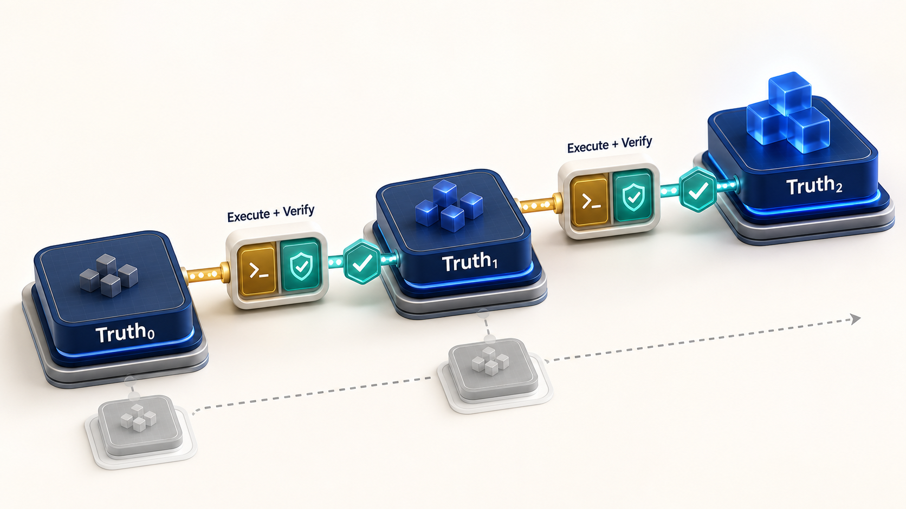
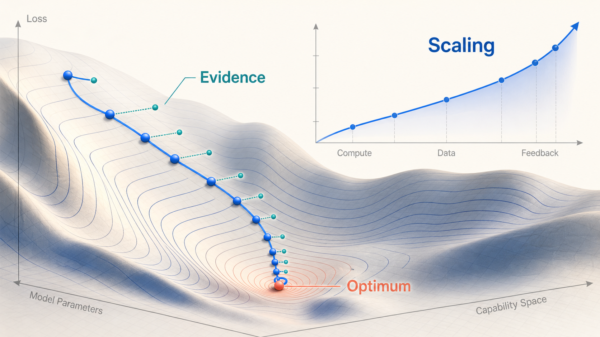

# AI时代下的 Source\-of\-Truth Advancement Loop

AI 将生成、执行和试错的成本压到了前所未有的低点。真正稀缺的资源已经变成**可信判断**：我们是否理解了正确的问题，是否掌握了足够的证据，是否把最新结论沉淀成了下一轮可以继承的事实状态。

**核心宣言：Don’t patch the output\. Advance the source of truth\.**

停止修补错误产物，推进产生结果的事实源。

**Source\-of\-Truth Advancement Loop** 把每一轮工作定义为一次可信状态迁移。Agent 从当前最可信状态出发，通过有目标的执行获得证据，再把证据写回事实源。每一轮都提高认知质量、减少关键不确定性，并把后续行动建立在更坚实的地基上。

**图 1｜从 Truth₀ 出发，沿验证节点螺旋上升，最终抵达 Goal。每一圈都完成一次认知增量。**


# 1\. AI 时代的工作单元已经发生变化

传统项目管理把计划视为主轴。团队先形成需求和计划，再按计划执行，出现偏差后继续修订计划。这套方式适合实现成本高、反馈周期长、变更代价大的环境。

AI 显著提高了实现速度。**原型、代码、分析、素材和测试可以在很短时间内产生**。此时，完整规划的边际价值开始下降，验证关键假设的价值快速上升。最有效的工作单元变成一次经过验证的状态迁移。

```text
模糊需求 → 快速执行 → 发现偏差 → 局部补丁 → 新冲突 → 更多补丁 → 推倒重来
```

```text
Truth₀ → 推演与执行 → 验证 → Truth₁ → 推演与执行 → 验证 → Truth₂ → … → Goal
```

它可以写成一个持续更新过程：

$T_n = \operatorname{Update}(T_{n-1}, Evidence_n, Decision_n)$

每一轮都完成一条明确的迁移：

$Truth_{n-1} \xrightarrow{Execute + Verify} Truth_n$

“继续聊下去”只会增加上下文长度。可信状态迁移会留下可复用的结论、证据与产物，后续 Agent、团队成员和自动化系统都可以从这里继续工作。

# 2\. Source of Truth 是当前最可信状态

这里的 Truth 指向当前经过验证、被协作者共同接受、足以驱动下一步行动的状态。它具备版本、证据和适用边界。它允许被新证据更新，也允许在关键假设被推翻时发生结构性修订。

一个高质量的 Truth Snapshot 需要明确区分七类信息：

|类型|含义|示例|
|---|---|---|
|**Fact**|已经确认的事实与外部约束|接口返回结构、法规、现网数据、用户明确要求|
|**Goal**|最终需要真实满足的结果|用户完成任务、指标达到目标、系统稳定运行|
|**Invariant**|后续迭代必须守住的性质|数据不丢失、入口 owner 正确、核心语义一致|
|**Hypothesis**|等待验证的判断|某个交互能够降低流失，某个架构能够降低延迟|
|**Decision**|当前基于证据做出的选择|选择方案 A，并记录理由、代价和复审条件|
|**Unknown**|仍然影响决策的不确定性|真实流量表现、边界场景、用户心智|
|**Artifact**|可以复现或检查的证据载体|代码、原型、测试、日志、数据、评审结论|

Truth Snapshot 是一份可信状态快照。它保持紧凑，直接服务于决策。讨论记录负责保存推导过程，最新 Truth 负责支配后续行动。

# 3\. 这套方法解决三类致命损耗

**它阻断原始误差的放大。** AI 能够沿着给定方向高速生成。方向错误时，产出速度会扩大返工面。Advancement Loop 要求每轮先确认核心矛盾，再用证据校准方向。错误会在进入规模化执行前暴露。

**它抑制上下文漂移。** 长对话会累积需求、解释、妥协、例外和临时决定。Truth Snapshot 把最新有效信息重新压缩成一个版本化状态。旧讨论保留为历史，最新状态成为唯一行动入口。

**它把验证速度转化为认知优势。** AI 能够快速生成可运行原型。团队可以优先把最关键的不确定性变成测试、用户反馈、数据或真实产物，再用结果更新判断。规划因此获得更高质量的输入。

# 4\. Advancement Loop 的最小闭环

**图 2｜每次“执行 \+ 验证”都会把证据吸收到下一版 Truth 中，旧版本进入可追溯历史。**



**Anchor：回到原始事实。** 明确目标、用户价值、外部约束和核心矛盾。Anchor 决定当前问题的坐标系，也决定哪些偏差值得立即纠正。

**Model：形成当前 Truth。** 把 Fact、Goal、Invariant、Hypothesis、Decision、Unknown 和 Artifact 写入同一份版本化快照。每个结论都带上证据和适用边界。

**Push：选择最有信息增益的行动。** 下一步行动直接指向关键不确定性。它可以是一段原型、一组测试、一次真实用户访谈、一条数据查询或一个最小可运行链路。

**Verify：用外部证据校验。** 测试结果、用户行为、生产数据、可复现日志和实际产物共同构成验证。主观确信无法替代外部证据。

**Commit：提交新的 Truth 版本。** 新证据进入事实源，失效假设明确退出，决定和计划随之更新。每次 Commit 都留下版本号、变更原因、证据和下一轮 Unknown。

下一步行动可以用**信息增益**来约束：

$NextAction = \arg\max_a \frac{ExpectedUncertaintyReduction(a)}{Cost(a) + Risk(a)}$

这条约束提醒团队控制行动规模。一次高质量 Push 会消除一个关键未知，并生成可以进入 Truth 的证据。

# 5\. Truth 决定方向，Plan 承担路径

Plan 是当前 Truth 推导出的临时路线。Truth 更新后，Plan 需要立即重新计算。团队可以大胆废弃旧计划，同时保持事实源完整、显式、可追溯。

|维度|Source of Truth|Plan|
|---|---|---|
|**职责**|描述当前最可信状态|描述从当前状态到目标的临时路径|
|**依据**|事实、约束、证据和已提交决定|Truth、资源、时间和依赖关系|
|**变化条件**|新证据改变认知|Truth、优先级或资源发生变化|
|**失败信号**|证据不足、版本混乱、假设伪装成事实|继续维护已经失效的路径|

> Plan 可以被推翻，Source of Truth 必须被显式更新。
>
>

# 6\. Truth 会沿着证据强度不断升级

Source of Truth 最初可能来自口头需求，随后应持续迁移到更强的载体。证据越接近真实运行环境，Truth 对个人表达和聊天上下文的依赖越低。

```text
口头需求
→ 明确规格
→ 可交互原型
→ 自动化测试
→ 已验证代码
→ 生产数据与用户结果
```

这条路径构成一条证据梯度。规格消除语言歧义，原型暴露交互问题，测试固化行为边界，代码形成可执行事实，生产数据检验真实价值。团队应持续把关键结论推进到更强的载体中。

# 7\. 底层原理：Scaling Law、梯度下降与逐步逼近

**图 3｜Scaling 扩大可达能力边界，梯度下降提供局部前进方向，Evidence 决定每一步是否值得提交。**



Source\-of\-Truth Advancement Loop 与现代机器学习共享一组底层思想：扩大能力上限，定义可度量目标，利用反馈修正方向，通过连续的小步更新逐步逼近更优状态。

**Scaling Law 扩大可达前沿。** 更多计算、更高质量的数据、更强模型和更密集反馈会提高系统能够表达、搜索和执行的能力范围。规模带来更大的解空间，也带来更快的实验速度。方向仍然需要由目标、约束和证据决定。

**梯度下降把误差转化为下一步方向。** 模型训练通过损失函数衡量当前状态与目标之间的差距，再沿着能够降低损失的方向更新参数。Advancement Loop 使用相同结构：Goal 定义优化方向，Invariant 构成约束，Verify 产生误差信号，Commit 完成状态更新。

**逐步逼近控制认知风险。** 每轮选择一个能够明显降低关键不确定性的最小行动。早期可以迈出较大的探索步，接近目标后需要缩小步长、增强验证精度。这样的节奏减少大范围误判，也提高最终状态的稳定性。

**收敛依赖正确的评价函数。** 错误指标会把系统带向错误的局部最优。验证标准必须连接真实目标。代码通过测试只能证明行为满足测试，产品指标增长也需要结合用户价值、长期影响和约束共同判断。

|优化概念|Loop 中的对应物|实践含义|
|---|---|---|
|**Capability Frontier**|模型、工具、数据与组织能力|决定系统能够探索多大的解空间|
|**Loss Function**|Goal 与验收标准|定义什么叫更接近真实目标|
|**Gradient**|验证产生的误差信号|指出下一步调整方向|
|**Learning Rate**|Push 的行动尺度|控制探索速度、风险和返工面|
|**Regularization**|Invariant 与边界约束|阻止局部收益破坏长期正确性|
|**Checkpoint**|版本化 Truth Snapshot|保存可回溯、可继承的可信状态|

这套类比揭示了一个关键结论：Scaling 提供能力，Loop 提供方向，Evidence 提供梯度，Versioned Truth 提供可继承的检查点。四者共同推动系统稳定逼近目标。

# 8\. 面向人和 Agent 的运行协议

这套方法需要一个可执行的状态协议。每一轮都从同一份 Truth Snapshot 开始，并以新版本 Truth 结束。聊天记录承担协作和推导，事实源承担状态管理。

```text
Version: Truth_n
Goal: 当前要真实满足的目标
Facts: 已验证事实与外部约束
Invariants: 任何迭代都要守住的性质
Hypotheses: 等待验证的判断
Decisions: 当前选择及其证据
Unknowns: 仍然影响方向的不确定性
Artifacts: 代码、原型、测试、日志、数据
Next Push: 能带来最大信息增益的最小行动
Commit Criteria: 证据满足什么条件后进入下一版 Truth
```

每次状态提交都要回答四个问题：本轮新增了什么证据，哪些判断发生变化，哪些不变量仍然成立，下一轮最关键的未知是什么。回答完整后，新的 Truth 才具备继承价值。

在 Codex 场景中，事实源应尽快进入代码、测试、规格、日志和真实数据。聊天中的结论需要写入可验证载体。下一次任务可以直接读取这些载体，恢复最新状态，并继续向前推进。

# 9\. 失效模式与边界

**过早冻结 Truth。** 假设被写成事实后，团队会围绕它维护一致性。每个 Truth Snapshot 都应显示证据等级和未决问题，让可推翻部分保持可见。

**验证与目标脱节。** 容易通过的测试会制造虚假收敛。验证标准需要覆盖用户可见结果、系统约束和真实运行条件。

**行动尺度过大。** 一次 Push 同时改变多个关键变量时，证据很难归因。行动需要围绕一个主要未知组织，保证结果能够明确更新 Truth。

**事实源停留在聊天中。** 对话会压缩、截断和漂移。关键结论需要进入稳定载体，并带上版本、owner、证据和更新时间。

**局部最优掩盖全局目标。** 单点指标、单次测试和短期反馈可能推动错误方向。Goal 与 Invariant 共同定义更完整的评价函数，周期性 Anchor 负责重新检查核心矛盾。

# 10\. Push the Source of Truth Forward

AI 时代的高效来自可信状态的持续积累。**团队从第一性原理建立 Truth₀**，用最小行动获得新证据，将 Truthₙ₋₁ 显式迁移为 Truthₙ，再把更强的 Truth 交给下一轮行动。

产物数量无法代表认知进展，真正的进展表现为事实更清晰、假设更少、证据更强、边界更明确、下一步更有方向。

> **从当前最可信状态出发。用证据决定下一步。让每一轮行动都把 Source of Truth 推向目标。**
>
>
